# BUG_HUNT

### BUG 1 
Ikon pada tombol aksi (Edit & Hapus) tidak muncul atau rusak (broken image) dikarenakan path file gambar tidak ditemukan atau file aset belum tersedia di direktori proyek.
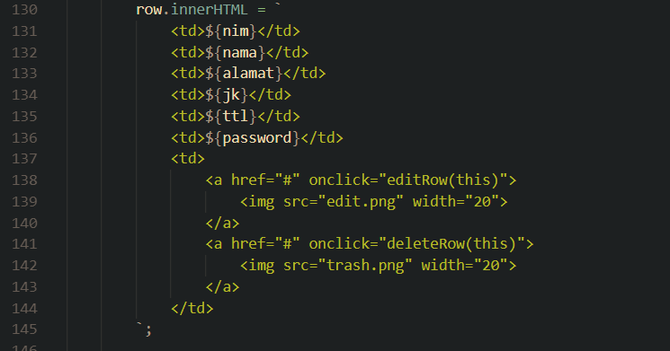

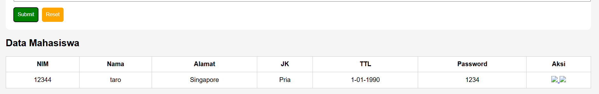
fix :
Menyediakan file aset edit.png dan trash.png di direktori yang sesuai dan memastikan pemanggilan path pada tag `````` sudah benar.
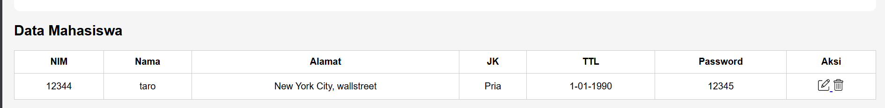

### BUG 2
Tanggal pada form di isi secara manual, Pengguna bisa menginput tanggal yang tidak ada secara kalender.
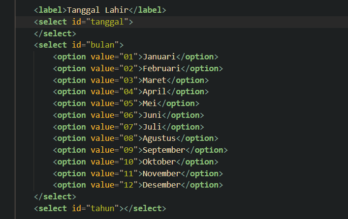
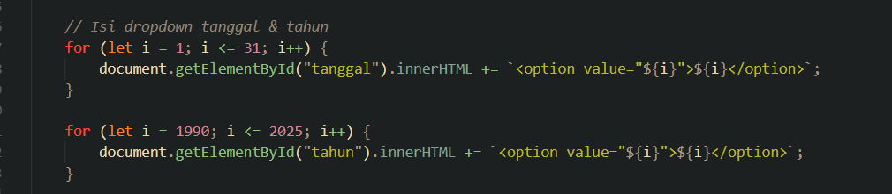
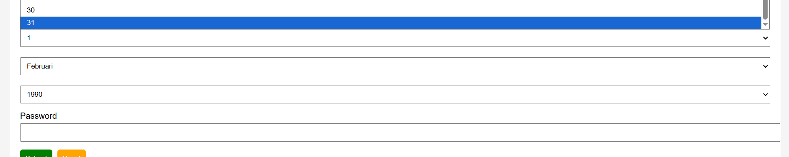

fix :
daripada menggunakan secara manual, bisa memakai ```type=date``` yang lebih efisien untuk penanggalan.
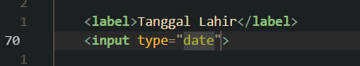
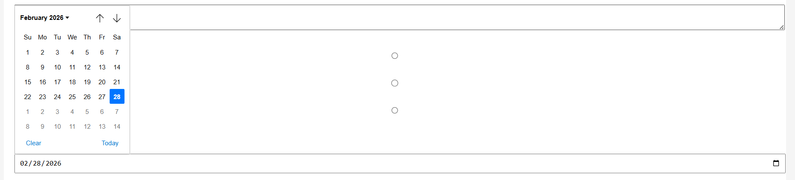

hapus script js yang masih menggunakan id tanggal bulan tahun
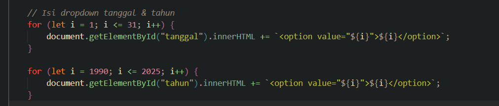
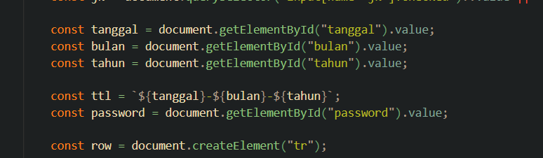

ganti dengan code berikut pada bagian tanggal lahir
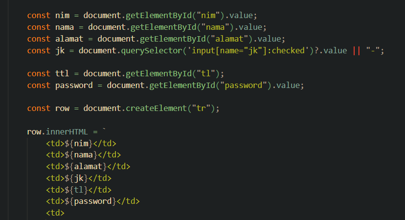

hasil fix:
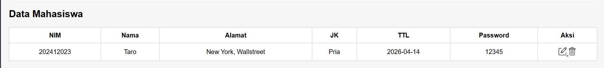

### BUG 3
agar data tetap tersimpan setelah refresh web/laman, menggunakan local storage
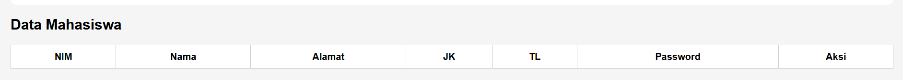

fix :
tambahkan function ini pada kode
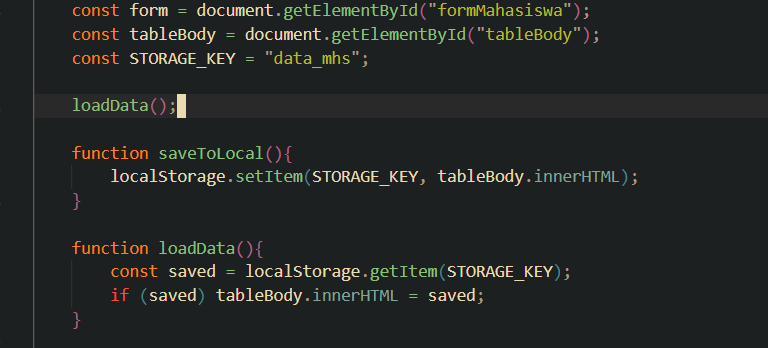

dan panggil function tersebut setelah tambah baris data, edit data, dan delete data
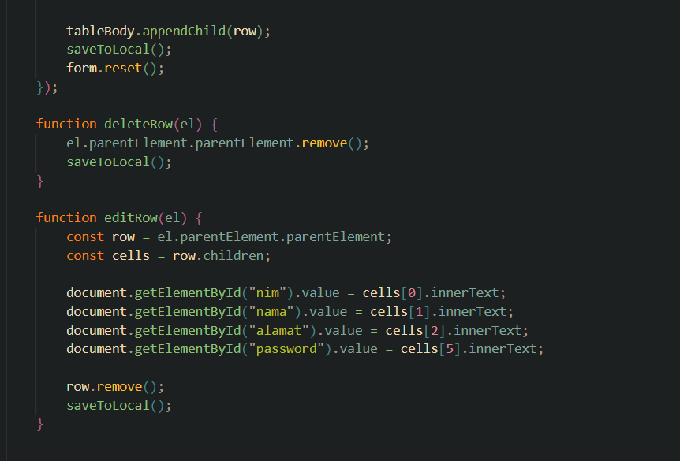

### BUG 4
password pada table data masih visible, ini merupakan celah keamanan.
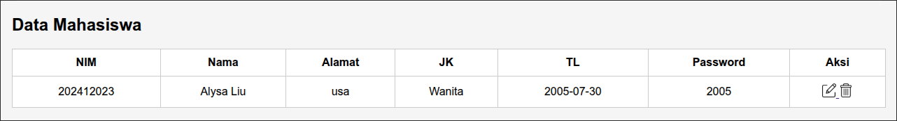

fix :
